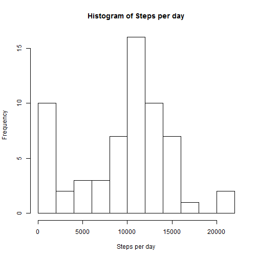
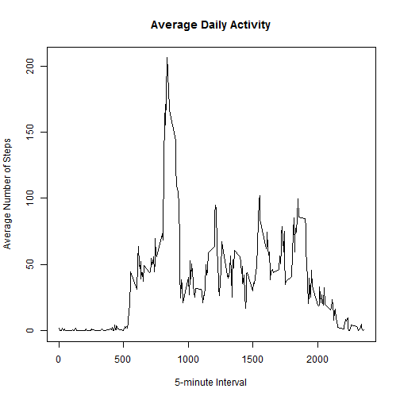
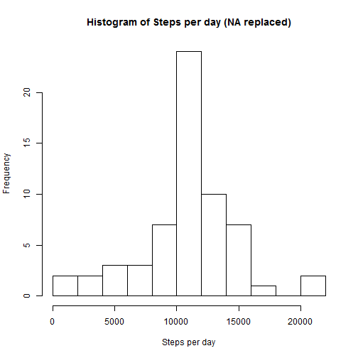
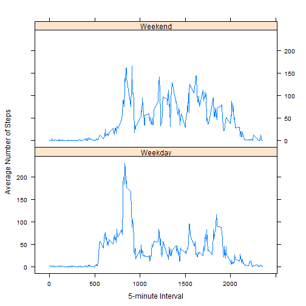

Reproducible Research: Peer Assessment 1
========================================


### Loading and preprocessing the data
We can read the data set directly from the zip file.


```r
activity_data <- read.csv(unz("activity.zip", "activity.csv"), header=TRUE ,sep=",")
```

Before we get to the questions, lets look at the base summary statistics for steps taken.


```r
summary(activity_data$steps)
```

```
##    Min. 1st Qu.  Median    Mean 3rd Qu.    Max.    NA's 
##     0.0     0.0     0.0    37.4    12.0   806.0    2304
```

Not suprisingly, there's a very long tail of 0 steps taken in most 5-minute intervals. Most people sleep and sit during most of the day. One interesting feature of this data set is that the mean is over 3 times the 3rd-quartile value. Another is the maximum value of 806 steps. Both of these features make sense for a person who spends most of their time sitting still, but occasionally runs.

### What is mean total number of steps taken per day?
Before we can calculate the mean total number of steps per day, we need to use the `aggregate` function to add up all of the steps taken during 5-minute intervals on each day.


```r
steps <- aggregate(activity_data$steps, by=list(activity_data$date), FUN=sum, na.rm=TRUE)
names(steps) <- c("Date", "steps")
head(steps)
```

```
##         Date steps
## 1 2012-10-01     0
## 2 2012-10-02   126
## 3 2012-10-03 11352
## 4 2012-10-04 12116
## 5 2012-10-05 13294
## 6 2012-10-06 15420
```

Since we've got the data aggregated, let's make a histogram to see how the number of steps per day are distributed.


```r
hist(steps$steps, breaks=15, main="Histogram of Steps per day", xlab="Steps per day")
```

 

From the histogram we can see that over 10,000 steps were taken on a majority of days in the testing period.

We can find the mean number of steps taken per day by calling `summary` on the aggregate data.


```r
summary(steps$steps, digits=5)
```

```
##    Min. 1st Qu.  Median    Mean 3rd Qu.    Max. 
##       0    6778   10395    9354   12811   21194
```

Here we can see that the mean is 9354 steps per day, while the median is significantly higher at 10395 steps per day.

Of course we could have also called the `mean` and `median` functions on the same vector individually.


```r
mean(steps$steps)
```

```
## [1] 9354
```

```r
median(steps$steps)
```

```
## [1] 10395
```


### What is the average daily activity pattern?

To get a sense of the average daily activity pattern, we need to average the number of steps taken in each 5-minute period across all days. We can do that using the `aggregate` function again.


```r
intervals <- aggregate(activity_data$steps, by=list(activity_data$interval), FUN=mean, na.rm=TRUE)
names(intervals) <- c("interval", "avg.steps")
head(intervals)
```

```
##   interval avg.steps
## 1        0   1.71698
## 2        5   0.33962
## 3       10   0.13208
## 4       15   0.15094
## 5       20   0.07547
## 6       25   2.09434
```

Now we can create a time-series plot of the average interval data to see what the average activity looks like across all days.


```r
plot(intervals$interval, intervals$avg.steps, type="l", main="Average Daily Activity", ylab="Average Number of Steps", xlab="5-minute Interval")
```

 

To find which 5-minute interval had the highest average number of steps, we can use the `which.max` function to find the index of the highest average value, then use the index to find the interval and number of steps.


```r
index <- which.max(intervals$avg.steps)
intervals$avg.steps[index]
```

```
## [1] 206.2
```

```r
intervals$interval[index]
```

```
## [1] 835
```

So the maximum average was 206.2 steps, taken during the 835 interval. (That's not the 835th interval, but the one that started at 8:35 AM.)

### Imputing missing values

We can use the `sum` and `is.na` functions to find the total number of missing values in the data set.


```r
sum(is.na(activity_data$steps))
```

```
## [1] 2304
```

As we saw earlier from the initial `summary`, there are 2304 missing values in the data set.

A good strategy for replacing these missing values is to use the mean value across each 5-minute interval. We can do this by merging the original data set with the mean values (from `interval`), then replace each missing value with the mean value from the same row.


```r
imputed_data <- merge(activity_data, intervals, by="interval", sort=FALSE)

# sort by date and interval so we can compare to the original data set.
imputed_data <- imputed_data[with(imputed_data, order(date, interval)),]

# replace NAs with the mean value from the same interval
imputed_data$steps[is.na(imputed_data$steps)] <- imputed_data$avg.steps[is.na(imputed_data$steps)]
head(imputed_data)
```

```
##     interval   steps       date avg.steps
## 1          0 1.71698 2012-10-01   1.71698
## 63         5 0.33962 2012-10-01   0.33962
## 128       10 0.13208 2012-10-01   0.13208
## 205       15 0.15094 2012-10-01   0.15094
## 264       20 0.07547 2012-10-01   0.07547
## 327       25 2.09434 2012-10-01   2.09434
```

If you view the full `imputed_data` data set at this point, you'll see that `NA`s in the `steps` column have been replaced with the mean number of steps for the same interval. Now we can remove the columns we no longer need.


```r
imputed_data <- imputed_data[, c("steps", "date", "interval")]
head(imputed_data)
```

```
##       steps       date interval
## 1   1.71698 2012-10-01        0
## 63  0.33962 2012-10-01        5
## 128 0.13208 2012-10-01       10
## 205 0.15094 2012-10-01       15
## 264 0.07547 2012-10-01       20
## 327 2.09434 2012-10-01       25
```

Now that the new data set has the same dimensions of the original data, we can create a new histogram with the imputed values.


```r
imp.steps <- aggregate(imputed_data$steps, by=list(imputed_data$date), FUN=sum, na.rm=TRUE)
names(imp.steps) <- c("Date", "steps")
hist(imp.steps$steps, breaks=15, main="Histogram of Steps per day (NA replaced)", xlab="Steps per day")
```

 

We can also get the mean and median number of steps from the imputed data set.


```r
mean(imp.steps$steps)
```

```
## [1] 10766
```

```r
median(imp.steps$steps)
```

```
## [1] 10766
```

As you can see, the mean number of steps is much higher with the missing data filled in. The median number of steps is only slightly higher, and the histogram looks more normal because fewer days have nearly zero steps due to missing data.

### Are there differences in activity patterns between weekdays and weekends?

To spot any differences in activity patterns between weekdays and weekends, we need to add a column to the data set that indicates what day of the week each data point is on. Before we can do that, we need to convert the `date` column in our data set to the Date data type. It's currently a factor.


```r
imputed_data$date <- as.Date(imputed_data$date)
imputed_data$day <- weekdays(imputed_data$date)
head(imputed_data)
```

```
##       steps       date interval    day
## 1   1.71698 2012-10-01        0 Monday
## 63  0.33962 2012-10-01        5 Monday
## 128 0.13208 2012-10-01       10 Monday
## 205 0.15094 2012-10-01       15 Monday
## 264 0.07547 2012-10-01       20 Monday
## 327 2.09434 2012-10-01       25 Monday
```

Now we can convert the new `day` column to indicate either `"Weekday"` or `"Weekend"`.


```r
imputed_data$day <- ifelse((imputed_data$day == "Saturday" | imputed_data$day == "Sunday"), "Weekend", "Weekday")
table(imputed_data$day)
```

```
## 
## Weekday Weekend 
##   12960    4608
```

Now we need to find the mean of the data across 5-minute intervals. Once again, we can use the `aggregate` function.


```r
imputed_data.avg.interval <- aggregate(imputed_data$steps, by=list(imputed_data$day, imputed_data$interval), mean, na.rm=TRUE, na.action=NULL)
names(imputed_data.avg.interval) <- c("day", "interval", "steps")
```

Finally, we can use the `lattice` library to plot the mean number of steps for each interval, split across Weekend and Weekday.


```r
library(lattice)
xyplot(imputed_data.avg.interval$steps ~ imputed_data.avg.interval$interval | imputed_data.avg.interval$day, layout=c(1,2), type="l", xlab="5-minute Interval", ylab="Average Number of Steps")
```

 

Based on this plot, you can get a rough idea of how this person's activity changes from weekdays to the weekend. For example, it looks like they're active earlier in the day on weekdays, so maybe they like to sleep in on the weekends. They have a peak in activity around the same time every day, so maybe they like to exercise at the same time every day. Finally, they seem to be more active throughout the day on the weekends, so maybe they work in an office or some other low-activity occupation.
